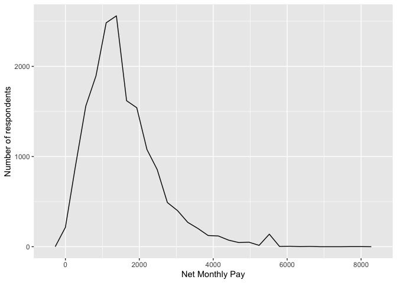
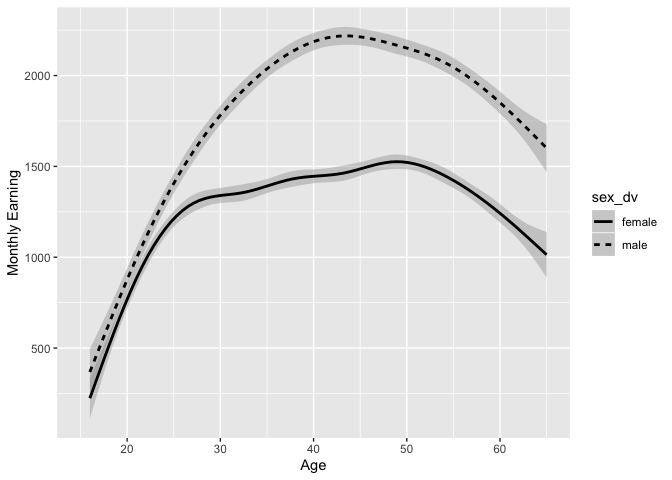
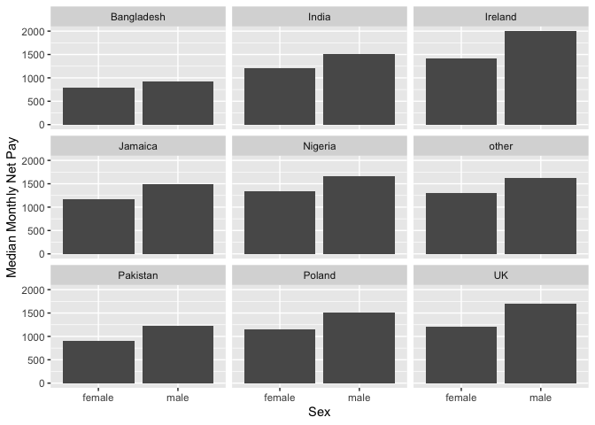
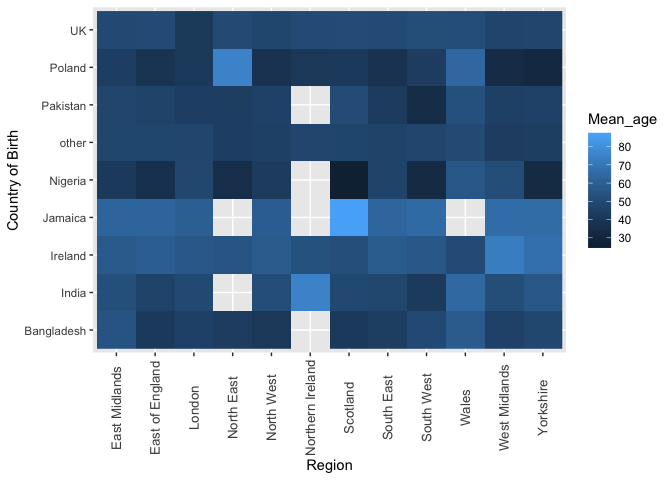
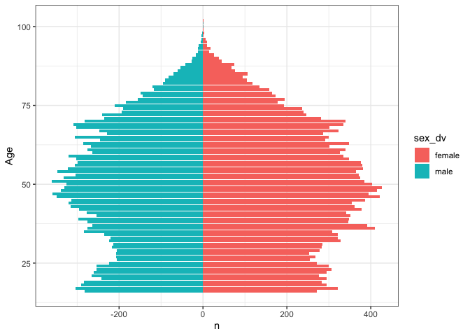

Statistical assignment 4
================
Chloe Neal \[099897\]
26/02/2020

In this assignment you will need to reproduce 5 ggplot graphs. I supply
graphs as images; you need to write the ggplot2 code to reproduce them
and knit and submit a Markdown document with the reproduced graphs (as
well as your .Rmd file).

First we will need to open and recode the data. I supply the code for
this; you only need to change the file paths.

    ```r
    library(tidyverse)
    Data8 <- read_tsv("/Users/chloeneal/University Year 2/Data Analysis 3/UKDA-6614-tab/tab/ukhls_w8/h_indresp.tab")
    Data8 <- Data8 %>%
        select(pidp, h_age_dv, h_payn_dv, h_gor_dv)
    Stable <- read_tsv("/Users/chloeneal/University Year 2/Data Analysis 3/UKDA-6614-tab/tab/ukhls_wx/xwavedat.tab")
    Stable <- Stable %>%
        select(pidp, sex_dv, ukborn, plbornc)
    Data <- Data8 %>% left_join(Stable, "pidp")
    rm(Data8, Stable)
    Data <- Data %>%
        mutate(sex_dv = ifelse(sex_dv == 1, "male",
                           ifelse(sex_dv == 2, "female", NA))) %>%
        mutate(h_payn_dv = ifelse(h_payn_dv < 0, NA, h_payn_dv)) %>%
        mutate(h_gor_dv = recode(h_gor_dv,
                         `-9` = NA_character_,
                         `1` = "North East",
                         `2` = "North West",
                         `3` = "Yorkshire",
                         `4` = "East Midlands",
                         `5` = "West Midlands",
                         `6` = "East of England",
                         `7` = "London",
                         `8` = "South East",
                         `9` = "South West",
                         `10` = "Wales",
                         `11` = "Scotland",
                         `12` = "Northern Ireland")) %>%
        mutate(placeBorn = case_when(
                ukborn  == -9 ~ NA_character_,
                ukborn < 5 ~ "UK",
                plbornc == 5 ~ "Ireland",
                plbornc == 18 ~ "India",
                plbornc == 19 ~ "Pakistan",
                plbornc == 20 ~ "Bangladesh",
                plbornc == 10 ~ "Poland",
                plbornc == 27 ~ "Jamaica",
                plbornc == 24 ~ "Nigeria",
                TRUE ~ "other")
        )
    ```

Reproduce the following graphs as close as you can. For each graph,
write two sentences (not more\!) describing its main message.

1.  Univariate distribution (20 points).
    
    ``` r
    ggplot(Data, aes(h_payn_dv)) +
      geom_freqpoly() +
    xlab("Net Monthly Pay") +
    ylab("Number of respondents")
    ```
    
    <!-- -->
    
    ``` r
    # As the net monthly pay increases, so does the number of respondents which peaks at around 2500 with a net monthly pay of  £1500. It the steadily declines as the monthly pay increases, with a slight increase in respondents at a pay of around £5500.
    ```

2.  Line chart (20 points). The lines show the non-parametric
    association between age and monthly earnings for men and women.
    
    ``` r
    ggplot(data=Data, aes(x=h_age_dv, y=h_payn_dv, group=sex_dv)) +
      geom_smooth(aes(linetype=sex_dv), color = "black")+
    xlim(15, 65)+
    xlab("Age") +
    ylab("Monthly Earning")
    ```
    
    <!-- -->
    
    ``` r
    # Regardless of age, its apparent that males have a higher monthly earning than females do; with the gap increasing at 25. Both sexes have an increase in monthly earning until around 50 where it continuously declines; potentially due to retirement.  
    ```

3.  Faceted bar chart (20 points).
    
    ``` r
    byPlace <- Data %>%
      filter(!is.na(placeBorn) & !is.na(sex_dv)) %>%
      group_by(placeBorn, sex_dv) %>%
      summarise(medianIncome = median(h_payn_dv, na.rm = TRUE))
    
    ggplot( byPlace, aes( x = sex_dv, y = medianIncome ) ) + 
      geom_bar( stat = "identity" ) + 
      facet_wrap( ~ placeBorn ) + 
      xlab("Sex") +
     ylab("Median Monthly Net Pay")
    ```
    
    <!-- -->
    
    ``` r
    #In all places born, males have a higher median monthly net pay than females do. Those in Bangladesh have a lowest median monthly net pay, while Ireland appears to have the highest median monthly net pay. 
    ```

4.  Heat map (20 points).
    
    ``` r
     byCRA <- Data %>%
        filter(!is.na(placeBorn) & !is.na(h_gor_dv)) %>%
      group_by(placeBorn, h_gor_dv) %>%
      summarise(Mean_age = mean(h_age_dv, na.rm = TRUE))
    
    ggplot(byCRA, aes(h_gor_dv, placeBorn)) + 
        geom_raster(aes(fill = Mean_age)) +
        xlab("Region") +
     ylab("Country of Birth") +
        theme(axis.text.x  = element_text(angle=90, vjust=0.5, size=10))
    ```
    
    <!-- -->
    
    ``` r
    # The darker the square, the lower the mean age is of that country of birth/region; meaning that those born in Nigeria who now live in the East Midlands have a mean age of around 30. Respondents born in India who now live in Northern Ireland have the highest mean age if roughly over 70.
    ```

5.  Population pyramid (20 points).
    
    ``` r
    age_sex <- Data %>%
        count(h_age_dv, sex_dv)
    
    ggplot(data = age_sex) +
      geom_bar(aes(h_age_dv, n, group=sex_dv, fill=sex_dv), stat = "identity", subset(age_sex,age_sex$sex_dv == "female")) +
      geom_bar(aes(h_age_dv,-n, group=sex_dv, fill=sex_dv), stat = "identity", subset(age_sex,age_sex$sex_dv == "male")) +
      coord_flip() +
      xlab("Age") +
      theme_bw() 
    ```
    
    <!-- -->
    
    ``` r
    # There appears to be more female participants than males, as the population pyramid is greater on one side. As age increases, the number of participants increases until around 50, where it slowly decreases until 75,then continues to decline rapidly; potentially due to the passing of participants. 
    ```
